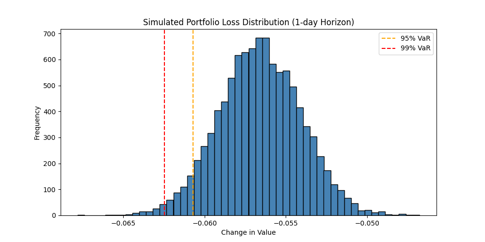

# Yield Curve PCA Analysis & Value-at-Risk Simulation

This project applies Principal Component Analysis (PCA) to the U.S. Treasury yield curve and extends it to simulate portfolio risk via Value-at-Risk (VaR) using yield factor dynamics. The approach is based entirely on data-driven components and econometric modeling of principal components.

---

## Objectives

- Understand yield curve dynamics via PCA
- Reconstruct yield curves using the top 3 factors
- Model time series behavior of PCs using AR(1)
- Simulate future scenarios of yield changes
- Estimate 1-day VaR for a 5Y zero-coupon bond

---

## PCA Analysis

### Cumulative Explained Variance


The first principal component explains about **97%** of the yield curve variation. The first 3 components together explain **over 99.9%**, confirming the PCA literature's result that level, slope, and curvature capture nearly all systematic movement.

---

### PCA Loadings


These eigenvector loadings determine how each component influences different maturities:

- **PC1 (Level)**: Roughly flat across maturities → parallel shifts
- **PC2 (Slope)**: Increases from long to short maturities → steepening or flattening
- **PC3 (Curvature)**: Humped shape → changes in mid-term yields

---

### Principal Component Time Series


- **PC1** shows long-term yield regime changes (e.g. policy cycles).
- **PC2** reflects short-term versus long-term divergence.
- **PC3** is more stationary, oscillating around zero.

These components form the basis of yield simulations.

---

### Yield Curve Reconstruction


We reconstruct the yield curve using only the first 3 PCs. The reconstructed curve almost perfectly overlays the original, showing the effectiveness of low-rank factor modeling.

---

### Reconstruction Error


Relative reconstruction error stays below **1%** for most of the period, dropping further after 2022. This reinforces that PCA with 3 factors suffices for accurate yield modeling.

---

## VaR Simulation & Portfolio Risk

We simulate 1-day changes in yield curve factors and translate them into bond price changes using:

\[
$\Delta P \approx -D \cdot \Delta y$
\]

for a **5Y zero-coupon bond**, where \( D \) is the modified duration.

---

### Method 1: AR(1) with Fitted Drift



- Loss distribution is skewed left.
- All outcomes are losses due to the **strong positive PC1 loading at 5Y** and **PC1 drift upward**.
- Estimated VaR levels:
  - 95% VaR: ~6.0%
  - 99% VaR: ~6.25%

---

### Method 2: AR(1) with Zero Drift (μ = 0)


- Similar shape, slightly more centered.
- Losses still dominate due to asymmetry from **loadings**, not just the drift.

---

## Key Takeaways

- PCA yields strong dimensionality reduction: 3 factors suffice.
- Bond risk simulation based on yield factor behavior captures realistic dynamics.
- Skewed loss profile is primarily due to **asymmetric PC loadings**, not time series drift alone.

---

## 🛠 Files

```
PCA_yield_curve.py          # Core script: PCA, AR modeling, VaR
*.png                       # Visualizations (auto-generated)
README.md                   # Project documentation
```

---

## Extensions

- Portfolio of multiple bonds across maturities
- Expected Shortfall (CVaR)
- Compare PCA-VaR to Historical/Monte Carlo VaR
- Introduce stochastic volatility or jump components in PCs

---

## Dependencies

- numpy
- pandas
- matplotlib
- scikit-learn
- statsmodels

Install with:

```bash
pip install -r requirements.txt
```

---
